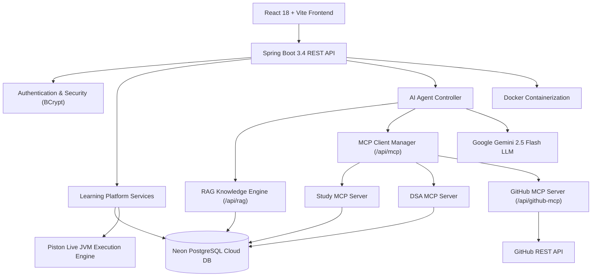
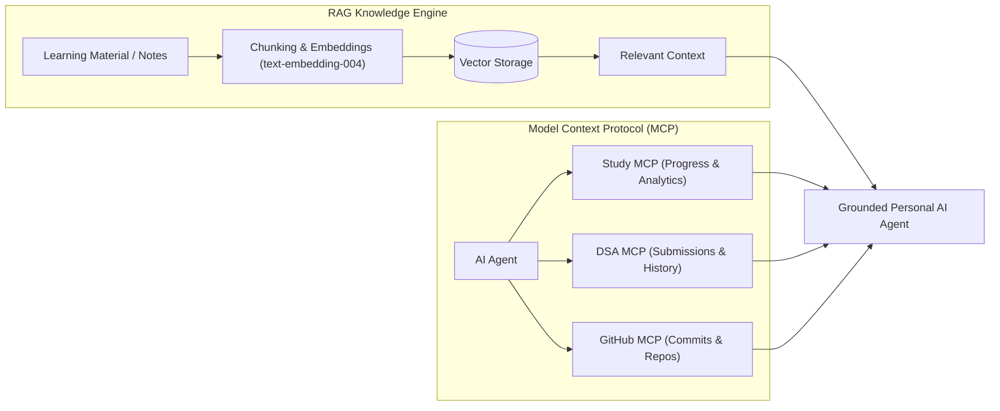

# 🚀 CodeMentor — MCP & RAG Powered Java Learning Agent

> An AI-powered Java backend learning platform that combines structured learning, live coding, personalized interview preparation, RAG-based knowledge retrieval, and Model Context Protocol (MCP) tools.

---

## 🌐 Live Demo

| Service | URL |
|:---|:---|
| **Frontend Web Application (React + Vite)** | https://java-study-tracker-omega.vercel.app/ |
| **Backend REST API (Spring Boot 3.4)** | https://java-study-tracker.onrender.com/api/progress/1 |
| **GitHub Repository** | https://github.com/Satyamshiv0079/java-study-tracker |

> ⚠️ The backend runs on Render's **free tier** and may take ~35 seconds to wake up after inactivity. Automatic retries & keep-alive pings are included.

---

## 📌 Overview

**CodeMentor** is a production-oriented Java learning and interview preparation platform designed around a structured 45-day backend engineering curriculum.

The platform combines:
- 📚 **Structured Java & Backend Curriculum**
- 💻 **Live Java Coding & JVM Execution (Piston Engine)**
- 🤖 **AI-Powered Code Review**
- 🎙️ **AI Technical Mock Interviews**
- 📊 **Learning Analytics & Placement Readiness Scoring**
- 📝 **Daily Study Notes**
- 💼 **AI-Powered Career & ATS Resume Tools**
- 🧠 **Retrieval-Augmented Generation (RAG)**
- 🔌 **Model Context Protocol (MCP) Integration**
- 🐙 **GitHub Activity Integration**
- 🐳 **Dockerized Deployment**
- 🔐 **Secure Authenticated Accounts (BCrypt + Spring Security)**

The goal is to move beyond a traditional study tracker and provide an **AI Learning Agent** that understands both the learner's knowledge base and their actual learning progress.

---

## 🏗️ System Architecture

---

## 🧠 AI Architecture (RAG vs. MCP)

CodeMentor strictly separates **knowledge retrieval** from **application tool access**.

---

## 🧰 Technology Stack

| Layer | Technology |
| :--- | :--- |
| **Frontend** | React 18, Vite, Tailwind CSS, Lucide Icons, Recharts |
| **Backend** | Java 17, Spring Boot 3.4, Spring Data JPA, Lombok |
| **Security** | Spring Security 6, BCrypt Password Hashing, CORS Wildcard |
| **Database** | PostgreSQL 15 (Neon Cloud DB) |
| **AI LLM** | Google Gemini 2.5 Flash (`v1beta`) |
| **RAG Pipeline** | Vector Embeddings (`text-embedding-004`) + Grounded Similarity Search |
| **MCP Suite** | Study MCP, DSA MCP, GitHub MCP Servers (`/api/mcp` & `/api/github-mcp`) |
| **Code Execution** | Piston Code Execution Engine API |
| **Containerization** | Docker & Docker Compose |
| **CI/CD** | GitHub Actions Pipeline (`.github/workflows/build.yml`) |
| **Hosting** | Vercel (Frontend), Render (Backend Docker), Neon (PostgreSQL) |

---

## 🎯 Core Features

### 1. 📊 Learning Dashboard
- 45-day progress grid with completed/pending indicators
- Study hours logged & active learning streak counters
- Dynamic placement-readiness heuristic scoring

### 2. 📚 Structured 45-Day Curriculum
- Complete roadmap: Java Core → OOP → Collections → Exception Handling → Multithreading & Concurrency → JVM & Memory → SQL → Spring Boot → REST APIs → Spring Security → Docker → Microservices → System Design.

### 3. 💻 Live Java DSA Sandbox & AI Code Review
- Live Java 17 compilation & execution via Piston API with stdout, stderr, and memory exit codes.
- Instant AI Code Review evaluating $O(N)$ time complexity, $O(1)$ space complexity, edge cases, and optimization strategies.

### 4. 🎙️ AI Technical Mock Interviewer
- Interactive verbal interview simulator evaluating answers across Java, Spring, SQL, and System Design with scores (1-10), missing keywords, and follow-up questions.

### 5. 🧠 RAG & MCP Agent Capabilities
- **Personalized Recommendations:** *"What should I study today?"* combines live user progress with RAG curriculum chunks.
- **Adaptive Interviews:** Focuses questions on user's specific weak topics based on past study logs.
- **Indexed Daily Notebook:** Personal notes automatically indexed for instant retrieval.

### 6. 💼 AI Career Hub
- **ATS Resume Analyzer:** PDF upload parsing with uninflated compatibility scoring (0-100%), bullet rewrites, and syllabus gap analysis.
- **LinkedIn Optimizer:** Recruiter-magnet headlines and cold outreach templates.

---

## 🚧 Feature Roadmap & Completion Status

- [x] **Phase 1 — Foundation:** 45-day curriculum, DSA sandbox, AI code review, authentication, PostgreSQL persistence, Docker containerization.
- [x] **Phase 2 — RAG Engine:** Knowledge document ingestion, embeddings API (`text-embedding-004`), grounded similarity context.
- [x] **Phase 3 — MCP Tool Suite:** Serverless MCP Tool server (`/api/mcp`) & Spring Boot `McpController`.
- [x] **Phase 4 — Agent Orchestration:** RAG + MCP Agent loop synthesizes user state + domain knowledge in AI Mentor.
- [x] **Phase 5 — GitHub Integration:** GitHub commit activity analysis and repo language breakdown (`/api/github-mcp`).
- [x] **Phase 6 — Production Hardening:** CORS wildcards, error fallback boundaries, 35s cold start timeouts, and GitHub Actions CI/CD validation.

---

## 📸 Application Screenshots & Feature Walkthrough

  <h3>1. 📊 Learning Dashboard</h3>
  
   <em>Dashboard — Real-time 45-day course progress, study hours logged, and placement readiness score</em>

 
 

  <h3>2. 📚 Syllabus & Notes</h3>
  
   <em>Syllabus & Notes — Daily curated lessons with objectives, theory, and embedded YouTube tutorials</em>

 
 

  <h3>3. 💻 Live Java DSA Sandbox & AI Code Review</h3>
  
   <em>DSA Practice Sandbox — 45 LeetCode challenges with live JVM execution & instant AI Code Review</em>

 
 

  <h3>4. 🎙️ AI Technical Mock Vivas</h3>
  
   <em>AI Interview Simulator — Interactive verbal Q&A with 1-10 scoring, missing keywords, and follow-up questions</em>

 
 

  <h3>5. 🚀 Capstone Project Tracker</h3>
  
   <em>Project Tracker — Interactive milestone checklist for building production Spring Boot REST APIs</em>

 
 

  <h3>6. 📈 Study Analytics & Insights</h3>
  
   <em>Analytics — Recharts trend graphs for study sessions and category readiness metrics</em>

 
 

  <h3>7. 🏆 Global Community Leaderboard</h3>
  
   <em>Leaderboard — Global rankings based on verified day completion, study hours, and earned badges</em>

 
 

  <h3>8. 💼 AI Career & Placement Suite</h3>
  
   <em>Career Hub — Drag & drop PDF resume ATS compatibility scoring, bullet upgrades, and LinkedIn optimizer</em>

 
 

  <h3>9. 🤖 AI Mentor Agent (RAG + MCP Powered)</h3>
  
   <em>AI Mentor — Context-aware learning assistant combining pgvector RAG retrieval and MCP live user state</em>

---

## 👨‍💻 Author

**Satyam Shiv**  
*Backend-focused Software Engineer \| Java \| Spring Boot \| Python \| AI*

- **GitHub:** [Satyamshiv0079](https://github.com/Satyamshiv0079)
- **LinkedIn:** [Satyam Shiv](https://www.linkedin.com/in/satyamshiv0079/)

---

## 📜 License

This project is licensed under the [MIT License](LICENSE).
