# 🚀 CodeMentor — Full-Stack 45-Day Java & Spring Boot Placement Platform

> An AI-powered Java backend learning platform combining a structured 45-day curriculum, live JVM execution, interactive AI mock vivas, ATS resume parsing, and context-grounded AI mentoring.

---

## 🌐 Live Demo

| Service | URL |
|:---|:---|
| **Frontend Web Application (React + Vite)** | https://java-study-tracker-omega.vercel.app/ |
| **Backend REST API (Spring Boot 3.4)** | https://java-study-tracker.onrender.com/api/progress/1 |
| **GitHub Repository** | https://github.com/Satyamshiv0079/java-study-tracker |

> ⚠️ The Spring Boot REST API is hosted on Render's **free tier** and will sleep after inactivity. Initial requests may take ~25-35 seconds while the container boots. Automatic client retries and keep-alive pings are built-in.

---

## 📌 Overview

**CodeMentor** is a full-stack web application and placement preparation suite designed around a structured 45-day Java & Spring Boot backend engineering curriculum.

The platform provides a complete ecosystem for computer science students and job aspirants:
- 📚 **Structured 45-Day Roadmap**: Java Core → OOP → Collections → Concurrency → JVM Internals → SQL → Spring Boot → Spring Security → Microservices → System Design.
- 💻 **Live Java 17 Sandbox**: Real-time code execution powered by the Piston Live JVM Engine.
- 🤖 **AI Code Review**: Automated $O(N)$ time/space complexity analysis and optimization suggestions via Google Gemini 2.5 Flash.
- 🎙️ **AI Mock Vivas**: Interactive verbal technical interviews with 1-10 performance scoring, keyword breakdown, and targeted follow-up questions.
- 🤖 **Grounded AI Mentor**: Context-aware study assistant that combines active user progress telemetry with curriculum topic knowledge.
- 🚀 **Capstone Project Tracker**: Interactive milestone checklist for building enterprise Spring Boot REST APIs.
- 💼 **AI Career Suite**: PDF resume parsing with ATS compatibility scoring, bullet rewrites, and recruiter-focused LinkedIn optimizations.
- 📊 **Learning Analytics & Benchmarks**: Real-time progress metrics and transparent peer benchmark comparisons.
- 🔐 **Spring Boot Security & Persistence**: BCrypt password encryption, Spring Security 6 CORS policies, and Neon PostgreSQL Cloud storage.

---

## 🏗️ System Architecture

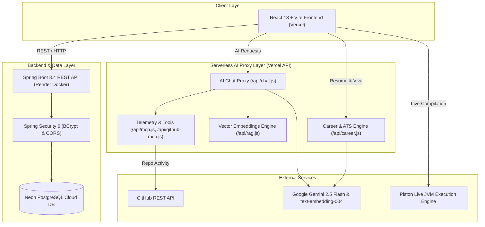

---

## 🧠 AI Integration & System Prompt Grounding

CodeMentor orchestrates AI features securely via Vercel serverless proxy handlers, keeping API keys protected from client-side exposure.

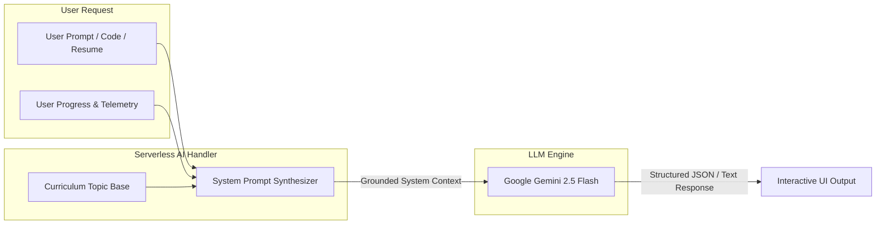

1. **Context Grounding**: The AI handler injects active user progress (completed days, solved DSA problems, study hours) and relevant curriculum topic references directly into the Gemini model system instructions.
2. **Code Evaluation**: Submits code snippets alongside runtime output from the Piston JVM engine to obtain precise efficiency analysis.
3. **Structured Outputs**: Formats resume feedback, viva scores, and code reviews into predictable JSON schemas for rich UI rendering.

---

## 🧰 Technology Stack

| Layer | Technology | Description |
| :--- | :--- | :--- |
| **Frontend** | React 18, Vite | Single-page application with modular tab navigation |
| **Styling & UI** | Tailwind CSS, Lucide Icons, Recharts | Responsive layout, theme toggle, dynamic analytics charts |
| **Backend Framework** | Java 17, Spring Boot 3.4 | RESTful web services, Spring Data JPA, Lombok, Maven |
| **Security** | Spring Security 6, BCrypt | Secure password hashing, wild card CORS origin filtering |
| **Database** | PostgreSQL 15 (Neon Cloud DB) | Serverless cloud relational database |
| **AI LLM** | Google Gemini 2.5 Flash (`v1beta`) | Core LLM for code reviews, mock vivas, and AI mentoring |
| **Embeddings** | Gemini `text-embedding-004` | 768-dimensional vector embedding generation |
| **Code Execution** | Piston Code Execution Engine API | Remote execution container for compiling & running Java 17 |
| **Containerization** | Docker & Dockerfile | Multi-stage Docker build for backend deployment |
| **CI/CD** | GitHub Actions | Automated build, test compile, and caching workflow |
| **Hosting** | Vercel & Render | Vercel (Frontend & Serverless API), Render (Backend Container) |

---

## 🎯 Core Features

### 1. 📊 Learning Dashboard
- 45-day interactive progress grid with completed/pending indicators.
- Live telemetry: study hours logged, streak counters, and readiness heuristics.
- Automatic backend sync with offline local storage fallback.

### 2. 📚 Structured 45-Day Curriculum
- Deeply technical 45-day syllabus covering Core Java, Collections, Multithreading, JVM Internals, SQL, Spring Boot, Spring Security, Docker, Microservices, and System Design.
- Includes clear learning objectives, theoretical deep-dives, and curated tutorial references.

### 3. 💻 Live Java DSA Sandbox & AI Code Review
- Live Java 17 compilation and execution via Piston API with stdout, stderr, and execution status.
- Instant AI Code Review providing $O(N)$ time & space complexity, edge-case analysis, and refactoring tips.

### 4. 🎙️ AI Technical Mock Interviewer (Vivas)
- Interactive verbal technical interview simulator.
- Evaluates responses across Java, Spring, SQL, and System Design with 1-10 scores, missing keyword analysis, and targeted follow-up questions.

### 5. 🤖 Grounded AI Mentor & Placement Coach
- Context-aware study assistant grounded in curriculum topic knowledge and live user progress.
- Explains complex backend concepts, clarifies daily syllabus topics, and suggests personalized next steps.

### 6. 🚀 Capstone Project Tracker
- 8-phase interactive checklist guiding learners through building a production-ready Spring Boot REST API project.

### 7. 📈 Learning Analytics & Insights
- Interactive Recharts visualization displaying study hour trends, day completion velocity, and topic readiness.

### 8. 🏆 Placement Community Benchmarks
- Learner leaderboard comparing personal progress against standard placement target benchmarks.
- Transparently labeled as community demo benchmarks for real-world peer evaluation.

### 9. 💼 AI Career Suite
- **ATS Resume Analyzer**: PDF upload parser providing uninflated compatibility scores (0-100%), bullet point rewrites, and skill gap identification.
- **LinkedIn Optimizer**: Recruiter-focused headline suggestions and cold outreach connection templates.

---

## 🚧 Feature Roadmap & Completion Status

- [x] **Phase 1 — Foundation**: 45-day curriculum, DSA sandbox, AI code review, Spring Security authentication, PostgreSQL persistence, and Docker setup.
- [x] **Phase 2 — AI Context Grounding**: Serverless Gemini integration (`/api/chat.js`), prompt context augmentation, and vector embedding support (`text-embedding-004`).
- [x] **Phase 3 — Serverless Telemetry Tools**: Modular serverless API tools (`/api/mcp.js`) and Spring Boot `UserController` progress syncing.
- [x] **Phase 4 — Career & Resume Suite**: PDF parsing, ATS scoring engine (`/api/career.js`), and interactive mock viva simulator.
- [x] **Phase 5 — Developer Activity Correlation**: GitHub commit activity analysis and repo language tracking (`/api/github-mcp.js`).
- [x] **Phase 6 — Production Hardening**: CORS wildcard policies, 35s cold-start timeouts, keep-alive pings, and GitHub Actions CI validation.

---

## 📸 Application Screenshots & Feature Walkthrough

  <h3>1. 📊 Learning Dashboard</h3>
  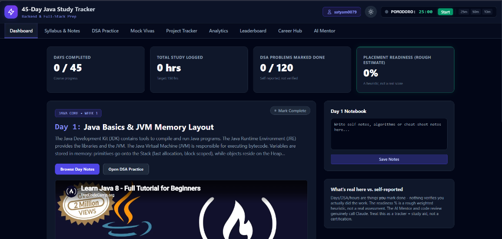
   <em>Dashboard — Real-time 45-day course progress grid, study hours logged, and placement readiness score</em>

 
 

  <h3>2. 📚 Syllabus & Notes</h3>
  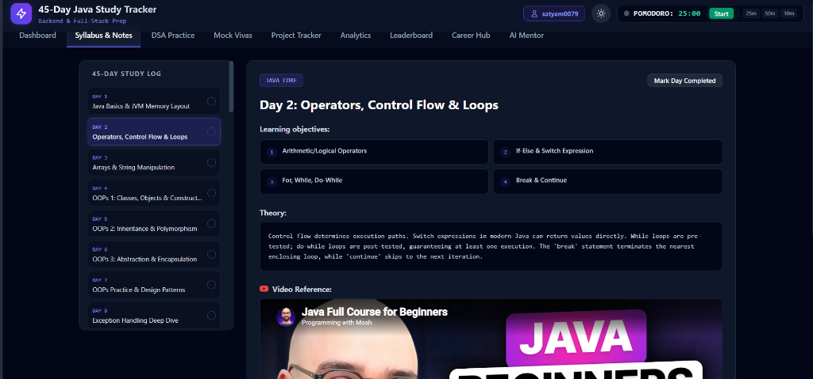
   <em>Syllabus & Notes — Daily curated lessons with objectives, theory, and personal study notes editor</em>

 
 

  <h3>3. 💻 Live Java DSA Sandbox & AI Code Review</h3>
  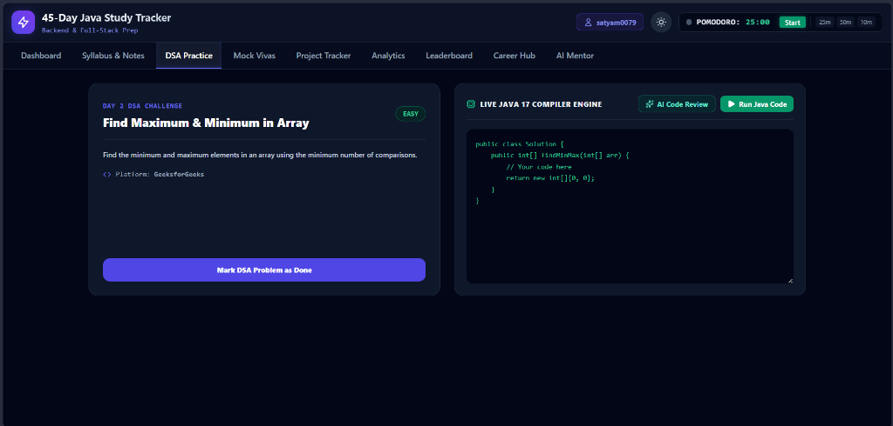
   <em>DSA Practice Sandbox — 45 LeetCode challenges with live JVM execution & instant AI Code Review</em>

 
 

  <h3>4. 🎙️ AI Technical Mock Vivas</h3>
  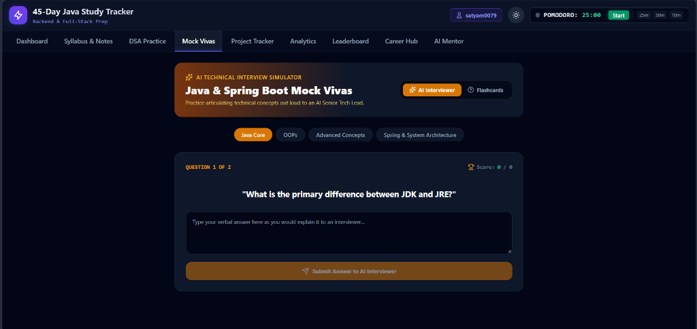
   <em>AI Interview Simulator — Interactive verbal Q&A with 1-10 scoring, missing keywords, and follow-up questions</em>

 
 

  <h3>5. 🚀 Capstone Project Tracker</h3>
  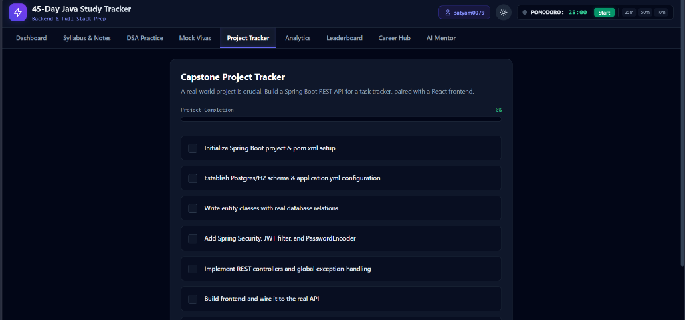
   <em>Project Tracker — Interactive milestone checklist for building production Spring Boot REST APIs</em>

 
 

  <h3>6. 📈 Study Analytics & Insights</h3>
  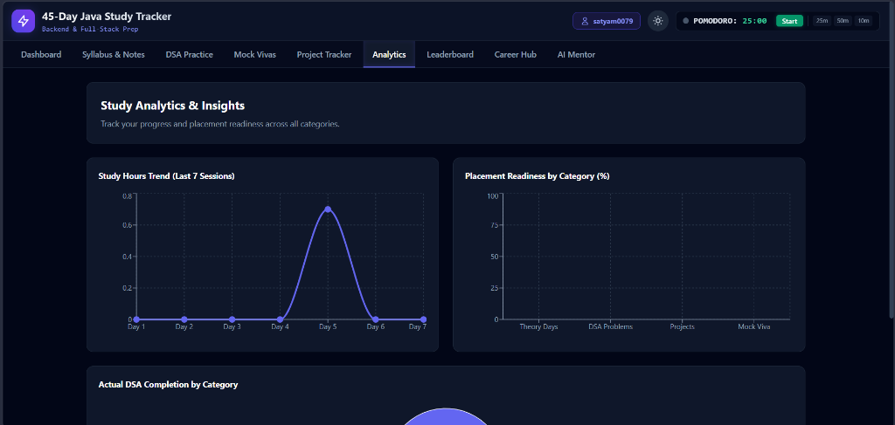
   <em>Analytics — Recharts trend graphs for study sessions and category readiness metrics</em>

 
 

  <h3>7. 🏆 Placement Community Benchmarks</h3>
  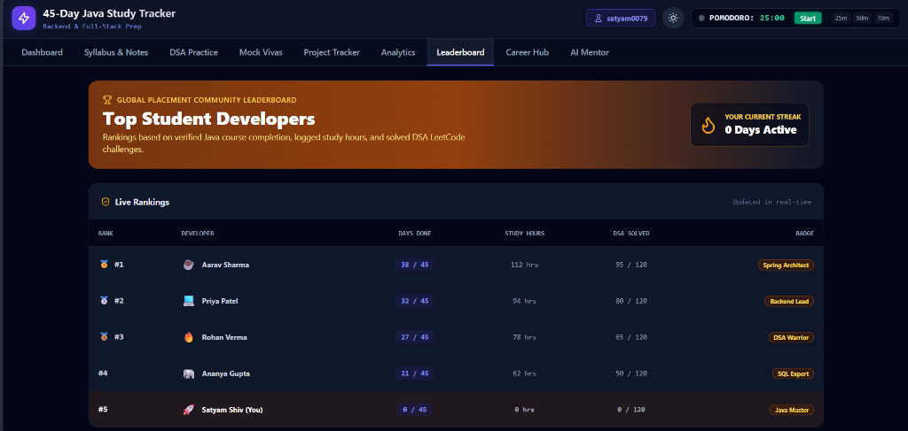
   <em>Community Benchmarks — Learner rankings compared against target placement standards (with transparent Demo Data benchmarks)</em>

 
 

  <h3>8. 💼 AI Career & Placement Suite</h3>
  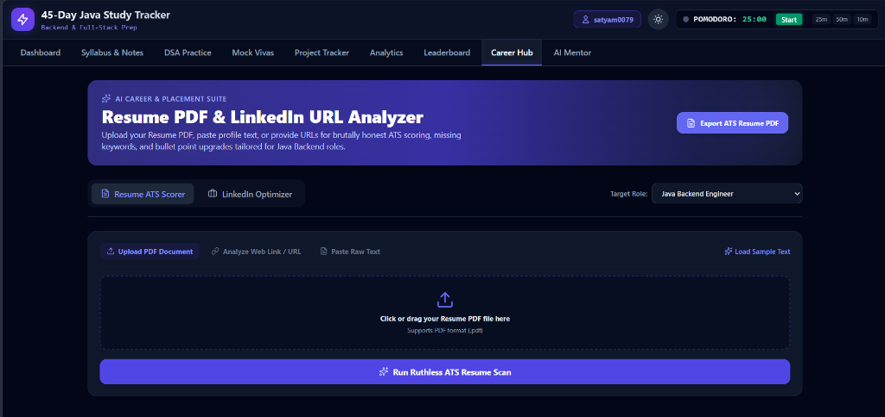
   <em>Career Hub — Drag & drop PDF resume ATS compatibility scoring, bullet upgrades, and LinkedIn optimizer</em>

 
 

  <h3>9. 🤖 AI Mentor Agent</h3>
  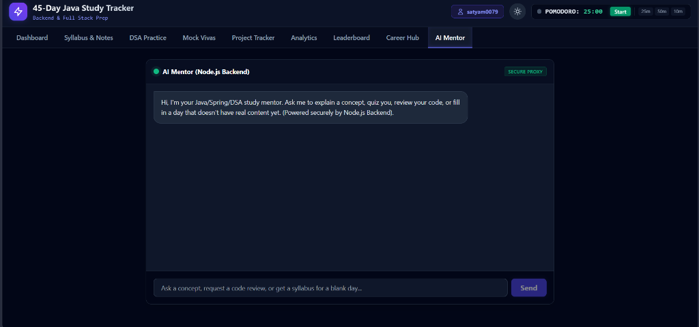
   <em>AI Mentor — Context-grounded learning assistant combining curriculum topic knowledge and active user progress</em>

---

## 👨‍💻 Author

**Satyam Shiv**  
*Backend-focused Software Engineer \| Java \| Spring Boot \| Python \| AI*

- **GitHub:** [Satyamshiv0079](https://github.com/Satyamshiv0079)
- **LinkedIn:** [Satyam Shiv](https://www.linkedin.com/in/satyamshiv0079/)

---

## 📜 License

This project is licensed under the [MIT License](LICENSE).
