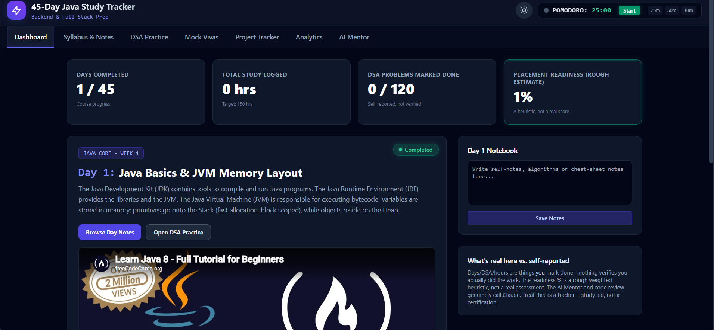
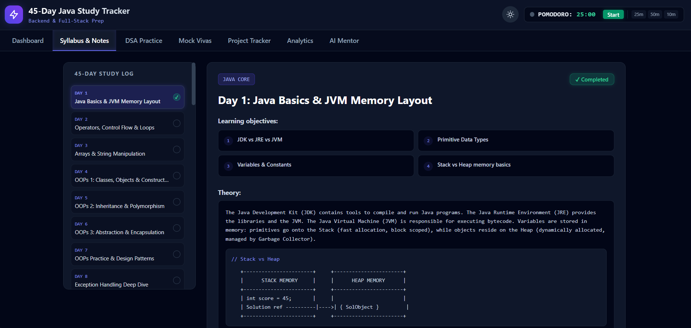
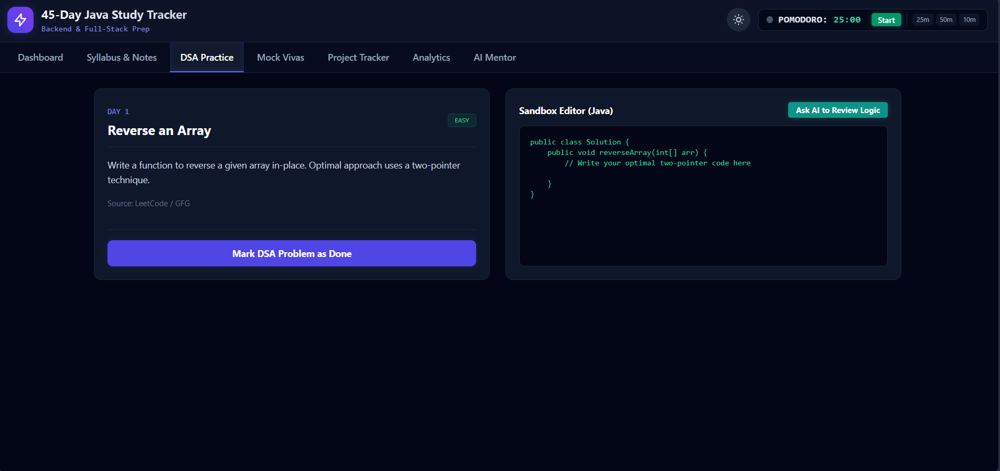
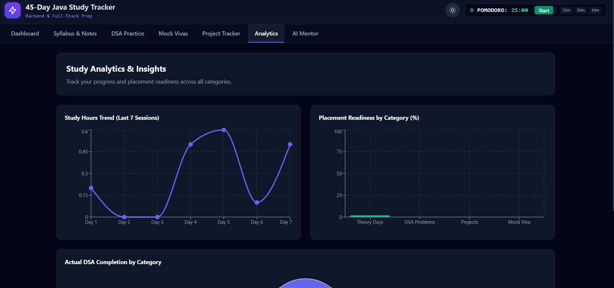
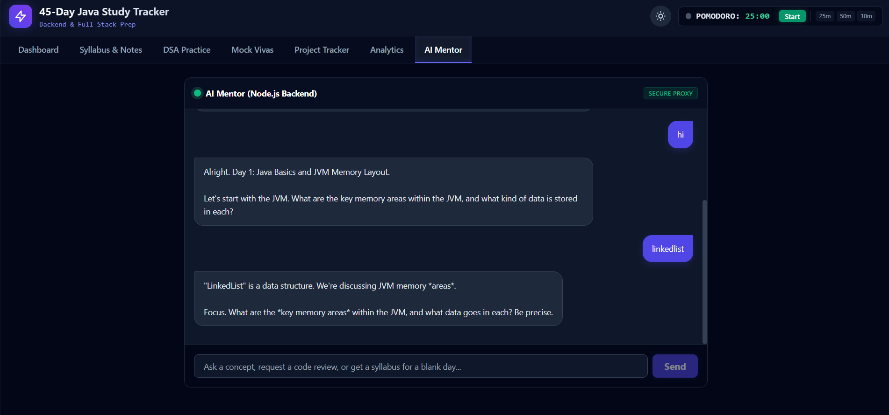

# 🚀 45-Day Java Full-Stack Study Tracker

> A highly interactive, full-stack study tracker designed to guide developers from zero to a backend placement in 45 days.

[](https://java-study-tracker-omega.vercel.app/)
[](https://java-study-tracker.onrender.com/api/progress/1)
[](https://openjdk.org/)
[](https://spring.io/projects/spring-boot)
[](https://react.dev/)
[](https://www.linkedin.com/in/satyamshiv0079/)
[](https://github.com/Satyamshiv0079/java-study-tracker/actions)
[](LICENSE)

---

## 🌐 Live Demo

| Service | URL |
|---------|-----|
| **Frontend (React + Vite)** | https://java-study-tracker-omega.vercel.app/ |
| **Backend REST API (Spring Boot)** | https://java-study-tracker.onrender.com/api/progress/1 |
| **GitHub Repository** | https://github.com/Satyamshiv0079/java-study-tracker |

> ⚠️ The backend runs on Render's **free tier** and may take ~50 seconds to wake up after inactivity. This is expected behaviour.

---

## ✨ Features

- **📚 45-Day Curated Syllabus** — Complete roadmap: Java Core → OOP → DSA → SQL → Spring Boot → Docker → CI/CD → System Design
- **☕ Real Java Spring Boot REST API** — Full 3-layer architecture (Controller → Service → Repository) powered by JPA & Hibernate
- **🎥 Embedded YouTube Lessons** — Hand-curated tutorials from freeCodeCamp, Amigoscode, ByteByteGo and more — one per day
- **💻 DSA Practice Sandbox** — 45 curated LeetCode problems with Java starter code (Easy → Hard progression)
- **📊 Analytics Dashboard** — Visual charts tracking study hours, DSA completion, and placement readiness score
- **🤖 AI Mentor** — Integrated Google Gemini-powered chat to explain concepts, quiz you, and review your code
- **🍅 Pomodoro Timer** — Built-in 25m / 50m / 10m study timer
- **🌗 Dark / Light Mode** — Glassmorphic dark mode and clean light mode

---

## 📸 Screenshots

<div align="center">
  
  <br/><em>Dashboard — study analytics and day progress</em>
</div>
<br/>
<div align="center">
  
  <br/><em>Syllabus & Notes — daily curated content with embedded video</em>
</div>
<br/>
<div align="center">
  
  <br/><em>DSA Sandbox — Java starter code for daily coding practice</em>
</div>
<br/>
<div align="center">
  
  <br/><em>Analytics — study hours and placement readiness charts</em>
</div>
<br/>
<div align="center">
  
  <br/><em>AI Mentor — powered by Google Gemini</em>
</div>

---

## 🛠️ Tech Stack

### Frontend
| Technology | Purpose |
|-----------|---------|
| React 18 + Vite | UI framework & build tool |
| Tailwind CSS | Styling |
| Recharts | Analytics charts |
| Lucide Icons | Icon library |

### Backend
| Technology | Purpose |
|-----------|---------|
| Java 17 | Core language |
| Spring Boot 3.4 | REST API framework |
| Spring Data JPA / Hibernate | ORM & database access |
| Spring Security | CORS & request security |
| H2 (In-Memory) | Development database |
| Docker | Containerization for Render deployment |

### Infrastructure
| Service | Purpose |
|---------|---------|
| Vercel | Frontend hosting (auto-deploy from GitHub) |
| Render | Backend hosting (Docker container) |
| GitHub | Source control & CI trigger |

---

## 🚀 Getting Started Locally

This is a **monorepo** — the React frontend and Spring Boot backend live in the same repository.

### Prerequisites
- Node.js 18+
- Java 17+
- Maven (included via `mvnw` wrapper)

### 1. Clone the repository
```bash
git clone https://github.com/Satyamshiv0079/java-study-tracker.git
cd java-study-tracker
```

### 2. Start the Java Backend
Open a terminal in the `backend/` folder:
```bash
cd backend

# Windows
mvnw.cmd spring-boot:run

# Mac / Linux
./mvnw spring-boot:run
```
The REST API starts at **`http://localhost:8080`**  
It auto-seeds an admin user on first startup.

### 3. Start the React Frontend
Open a **second terminal** in the root folder:
```bash
npm install
npm run dev
```
The UI starts at **`http://localhost:5173`**

### 4. Setup AI Mentor (optional)
Create a `.env` file in the root directory:
```env
GEMINI_API_KEY=your_gemini_api_key_here
```

---

## 🌐 Deployment

### Architecture
```
Browser
  │
  ├──► Vercel (React Frontend)
  │       └── fetch() calls ──────────────────────►  Render (Spring Boot API)
  │                                                        └── H2 In-Memory DB
  │
  └──► Node.js Serverless (Vercel API route)
          └── Google Gemini API (AI Mentor)
```

### Frontend — Vercel
1. Import `Satyamshiv0079/java-study-tracker` on [vercel.com](https://vercel.com)
2. Add environment variable: `GEMINI_API_KEY=your_key`
3. Deploy — Vercel auto-deploys on every push to `main`

### Backend — Render (Docker)
1. Create a **Web Service** on [render.com](https://render.com)
2. Connect `Satyamshiv0079/java-study-tracker`
3. Set **Root Directory** to `backend`
4. Set **Runtime** to `Docker`
5. Deploy!

The `backend/Dockerfile` handles the full multi-stage build automatically.

---

## 📡 API Endpoints

| Method | Endpoint | Description |
|--------|----------|-------------|
| `GET` | `/api/users` | Get all users |
| `GET` | `/api/progress/{userId}` | Get all day progress for a user |
| `POST` | `/api/progress/{userId}/{dayNumber}` | Toggle a day complete/incomplete |

---

## 📝 License

This project is open-source and available under the [MIT License](LICENSE).

---

<div align="center">
  Built with ☕ Java, ⚛️ React & 💚 by <strong><a href="https://github.com/Satyamshiv0079">Satyam Shiv</a></strong><br/>
  Connect on <a href="https://www.linkedin.com/in/satyamshiv0079/">LinkedIn</a> | Star ⭐️ this repo if you find it helpful!
</div>
