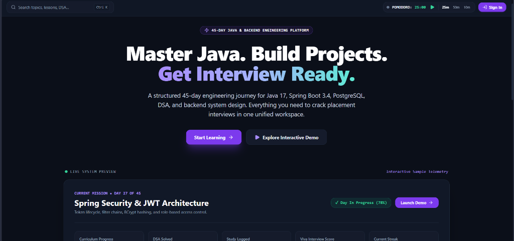
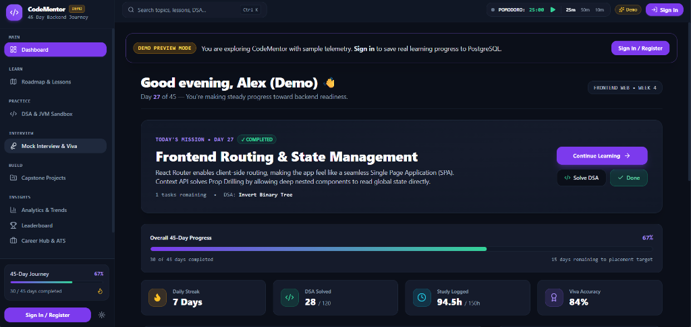
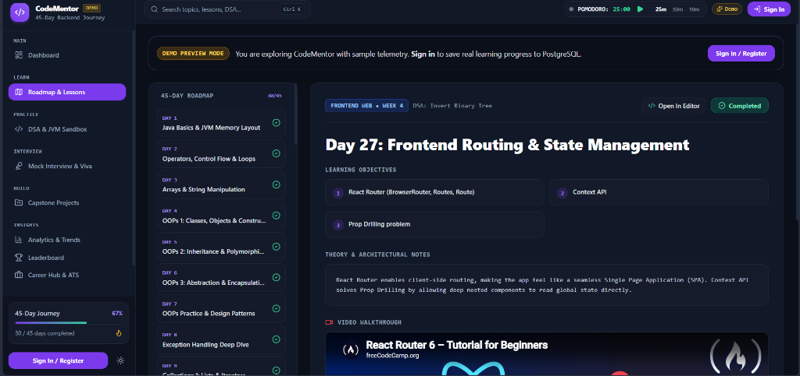
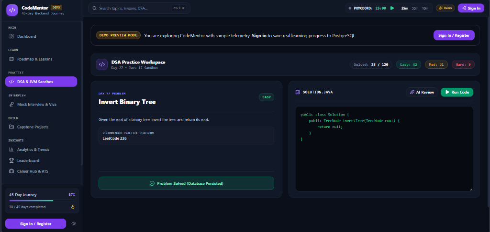
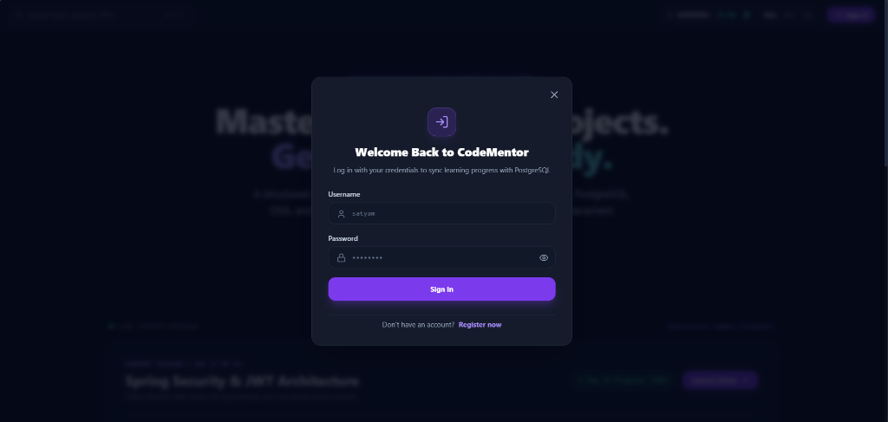
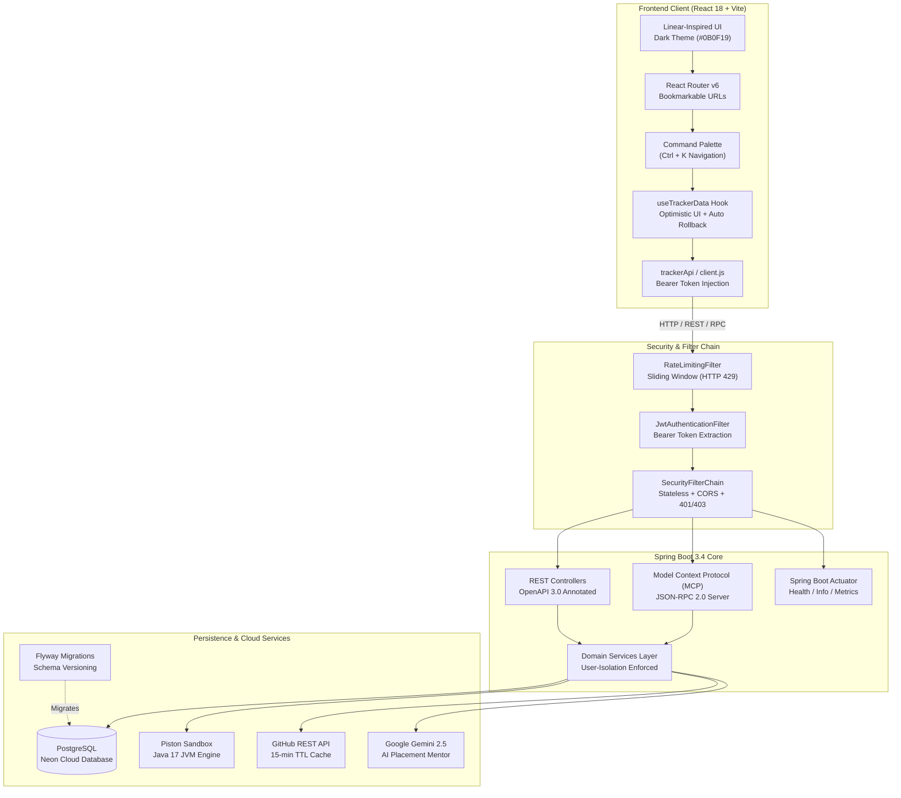
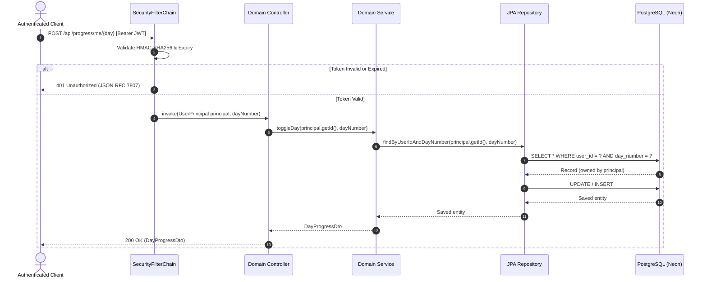

# 🚀 CodeMentor — Production-Grade 45-Day Java & Spring Boot Placement Platform

[](https://www.oracle.com/java/)
[](https://spring.io/projects/spring-boot)
[](https://spring.io/projects/spring-security)
[](https://neon.tech/)
[](https://flywaydb.org/)
[](https://react.dev/)
[](https://swagger.io/)
[](https://modelcontextprotocol.io/)
[](https://junit.org/junit5/)

A full-stack, interview-grade placement preparation platform and developer-learning workspace engineered to take software engineers from core Java fundamentals to production Spring Boot microservices, high-frequency DSA, mock viva assessments, and real portfolio deployment.

---

## 🌐 Live Deployments & Documentation

- **Web Application**: [https://java-study-tracker.vercel.app](https://java-study-tracker.vercel.app)
- **Production REST API**: [https://java-study-tracker.onrender.com](https://java-study-tracker.onrender.com)
- **Interactive Swagger UI**: [https://java-study-tracker.onrender.com/swagger-ui/index.html](https://java-study-tracker.onrender.com/swagger-ui/index.html)
- **Cloud Health Probe (Actuator)**: [https://java-study-tracker.onrender.com/actuator/health](https://java-study-tracker.onrender.com/actuator/health)

---

## 📸 Product Walkthrough & Interface Tour

### 1. Developer Landing Experience & Live Mission Preview
*A modern Linear-inspired dark aesthetic featuring instant syllabus jump, active mission preview, and interactive exploratory demo mode.*


### 2. Central Preparation Dashboard & Telemetry
*Answers Where am I?, What's next?, and Am I improving? with real-time streak calculation, DSA progress, Pomodoro study logging, and viva accuracy.*


### 3. Structured 45-Day Curriculum & Technical Roadmap
*Day-by-day Java 17 to Spring Boot progression with structured learning objectives, architectural theory notes, curated video walkthroughs, and syllabus completion toggling.*


### 4. DSA Practice Workspace & Java 17 Sandbox
*Interactive coding environment with LeetCode correlation, real-time code editor, AI code analysis, and live multi-language execution via the Piston JVM engine.*


### 5. Secure Authentication & PostgreSQL Synchronization
*Clean modal authentication dialog with BCrypt password hashing, signed JWT Bearer tokens, and seamless transition from demo preview to authenticated PostgreSQL persistence.*


---

## 📌 Executive Architecture & Engineering Highlights

CodeMentor is engineered with strict production standards, zero fake data generation, and resilient server-side truth:

- ✅ **Single Source of Truth**: All student progress (curriculum completion, DSA submissions, study sessions, notes, viva attempts, capstone milestones) persists in PostgreSQL (Neon Cloud) backed by connection pool tuning (HikariCP).
- ✅ **Spring Security 6 & Fail-Fast JWT**: Stateless JWT token authentication with HMAC-SHA256. Secret keys are strictly validated at boot time (>= 256 bits / 32 bytes) with zero insecure fallback defaults.
- ✅ **Multi-Domain User Isolation (43 Automated Tests)**: Rigorous database ownership checks ensure User B can never read or mutate User A's progress, DSA code submissions, notes, or study hours.
- ✅ **Optimistic UI with Automatic Rollbacks**: Frontend state updates render instantly for 60fps responsiveness; on any network or server failure, state automatically snapshots and rolls back with an actionable toast alert.
- ✅ **Sliding-Window IP Rate Limiter**: Custom `RateLimitingFilter` enforces 10 req/min on authentication endpoints (`/api/users/**`) and 120 req/min across general APIs, returning HTTP 429 with RFC-compliant `Retry-After` headers.
- ✅ **Model Context Protocol (MCP) JSON-RPC 2.0 Server**: Standard MCP protocol handler at `POST /api/mcp/rpc` (`tools/list` and `tools/call`) with JSON Schema input validation, plus developer REST endpoints (`/api/tools/**`).
- ✅ **Live GitHub API Integration**: Dedicated `GitHubService` with in-memory TTL caching (15 minutes) and strict zero-fabrication error propagation (HTTP 429/503) instead of fake repository mocking.
- ✅ **Spring Boot Actuator**: Dedicated `/actuator/health` and `/actuator/info` endpoints for cloud load balancer liveness probes, with protected management metrics.
- ✅ **Flyway Database Versioning**: Automated schema migrations (`V1__init_schema.sql`, `V2__seed_curriculum.sql`) enforcing baseline-on-migrate and `ddl-auto: validate` in production.
- ✅ **Client-Side Routing & Developer Theme**: React Router (`/`, `/demo`, `/login`, `/register`, `/app/*`), Linear/Notion-inspired dark palette (`#0B0F19`, `#111827`, accent `#7C3AED`), Command Palette (`Ctrl + K`), and Demo Guard Modal.

---

## 🏗️ System Architecture


```mermaid
flowchart TD
    subgraph Client["Frontend Client (React 18 + Vite)"]
        UI["Linear-Inspired UI\nDark Theme (#0B0F19)"]
        Router["React Router v6\nBookmarkable URLs"]
        CmdK["Command Palette\n(Ctrl + K Navigation)"]
        State["useTrackerData Hook\nOptimistic UI + Auto Rollback"]
        ApiClient["trackerApi / client.js\nBearer Token Injection"]
    end

    subgraph Gateway["Security & Filter Chain"]
        RateLimit["RateLimitingFilter\nSliding Window (HTTP 429)"]
        JwtFilter["JwtAuthenticationFilter\nBearer Token Extraction"]
        SecConfig["SecurityFilterChain\nStateless + CORS + 401/403"]
    end

    subgraph Backend["Spring Boot 3.4 Core"]
        Controllers["REST Controllers\nOpenAPI 3.0 Annotated"]
        McpServer["Model Context Protocol (MCP)\nJSON-RPC 2.0 Server"]
        Services["Domain Services Layer\nUser-Isolation Enforced"]
        Actuator["Spring Boot Actuator\nHealth / Info / Metrics"]
    end

    subgraph DataStore["Persistence & Cloud Services"]
        Flyway["Flyway Migrations\nSchema Versioning"]
        DB[("PostgreSQL\nNeon Cloud Database")]
        Piston["Piston Sandbox\nJava 17 JVM Engine"]
        GitHub["GitHub REST API\n15-min TTL Cache"]
        Gemini["Google Gemini 2.5\nAI Placement Mentor"]
    end

    UI --> Router
    Router --> CmdK
    CmdK --> State
    State --> ApiClient
    ApiClient -->|HTTP / REST / RPC| RateLimit

    RateLimit --> JwtFilter
    JwtFilter --> SecConfig
    SecConfig --> Controllers
    SecConfig --> McpServer
    SecConfig --> Actuator

    Controllers --> Services
    McpServer --> Services
    Services --> DB
    Flyway -.->|Migrates| DB

    Services --> Piston
    Services --> GitHub
    Services --> Gemini
```

---

## 🔐 Security & User-Isolation Architecture

All endpoints enforce strict tenancy separation at the database and service layers. When a user performs an operation, their identity is extracted exclusively from the validated JWT token principal (`UserPrincipal.getId()`), never accepted as an unverified query or body parameter.


```mermaid
sequenceDiagram
    autonumber
    actor User as Authenticated Client
    participant Sec as SecurityFilterChain
    participant Ctrl as Domain Controller
    participant Svc as Domain Service
    participant Repo as JPA Repository
    participant DB as PostgreSQL (Neon)

    User->>Sec: POST /api/progress/me/{day} [Bearer JWT]
    Sec->>Sec: Validate HMAC-SHA256 & Expiry
    alt Token Invalid or Expired
        Sec-->>User: 401 Unauthorized (JSON RFC 7807)
    else Token Valid
        Sec->>Ctrl: invoke(UserPrincipal principal, dayNumber)
        Ctrl->>Svc: toggleDay(principal.getId(), dayNumber)
        Svc->>Repo: findByUserIdAndDayNumber(principal.getId(), dayNumber)
        Repo->>DB: SELECT * WHERE user_id = ? AND day_number = ?
        DB-->>Repo: Record (owned by principal)
        Repo->>DB: UPDATE / INSERT
        DB-->>Repo: Saved entity
        Repo-->>Svc: Saved entity
        Svc-->>Ctrl: DayProgressDto
        Ctrl-->>User: 200 OK (DayProgressDto)
    end
```

---

## 🤖 Model Context Protocol (MCP) & AI Tool Integration

CodeMentor implements a standard **Anthropic Model Context Protocol (MCP)** JSON-RPC 2.0 server at `POST /api/mcp/rpc`, giving external LLM agents (Claude, Gemini, Cursor) full programmatic context about a developer's learning journey.

### Supported MCP Methods

1. **`tools/list`**: Returns descriptors and JSON Schemas for all registered tools:
   - `get_user_progress`: Fetches syllabus completion counts and percentage.
   - `get_curriculum_gaps`: Returns pending days and next recommended study topic.
   - `get_github_summary`: Returns verified public repositories and syllabus alignment.
   - `search_curriculum`: Semantic search over 45-day curriculum with verified citations.

2. **`tools/call`**: Executes a tool by name with arguments and returns standard MCP content output:

```json
// Example: POST /api/mcp/rpc
{
  "jsonrpc": "2.0",
  "id": 101,
  "method": "tools/call",
  "params": {
    "name": "get_user_progress",
    "arguments": {}
  }
}
```

Response:
```json
{
  "jsonrpc": "2.0",
  "id": 101,
  "result": {
    "content": [
      {
        "type": "text",
        "text": "{\"userId\":1,\"completedDaysCount\":14,\"totalDays\":45,\"completionPercentage\":31}"
      }
    ]
  }
}
```

---

## 📊 Complete REST API Surface

| Method | Endpoint | Access | Description |
|:---|:---|:---|:---|
| **POST** | `/api/users/register` | Public | Register new user account with BCrypt password hashing |
| **POST** | `/api/users/login` | Public | Authenticate user credentials & issue JWT Bearer token |
| **GET** | `/api/health` | Public | Lightweight health check status |
| **GET** | `/actuator/health` | Public | Spring Boot Actuator cloud liveness / readiness probe |
| **GET** | `/actuator/info` | Public | Application build and runtime info |
| **GET** | `/actuator/metrics` | Admin | JVM memory, thread count, garbage collection metrics |
| **GET** | `/api/progress/me` | User | Retrieve current user's 45-day curriculum completion list |
| **POST** | `/api/progress/me/{dayNumber}` | User | Toggle completion status for specific day |
| **GET** | `/api/dsa/me` | User | Fetch all DSA problem submissions, code, and statuses |
| **GET** | `/api/dsa/me/{dayNumber}` | User | Fetch code and submission for a specific day |
| **POST** | `/api/dsa/me` | User | Save or update DSA code submission and LeetCode link |
| **POST** | `/api/dsa/me/{dayNumber}/toggle` | User | Toggle solved/unsolved status for day's DSA problem |
| **GET** | `/api/study-sessions/me` | User | Fetch logged study sessions history |
| **GET** | `/api/study-sessions/me/total-hours`| User | Retrieve aggregated study hours, minutes, and count |
| **POST** | `/api/study-sessions/me` | User | Log a study session (Pomodoro or manual duration) |
| **GET** | `/api/notes/me` | User | Fetch all user notes mapped by day number |
| **GET** | `/api/notes/me/{dayNumber}` | User | Fetch note content for a specific day |
| **POST** | `/api/notes/me/{dayNumber}` | User | Save or update note content for a specific day |
| **GET** | `/api/viva/me` | User | Fetch all previous mock viva interview attempts |
| **GET** | `/api/viva/me/summary` | User | Aggregated viva statistics (accuracy, score, attempts) |
| **POST** | `/api/viva/me` | User | Record completed viva attempt with AI scoring breakdown |
| **GET** | `/api/analytics/me` | User | Full learning telemetry, streak, and competency scores |
| **GET** | `/api/leaderboard` | User | Global leaderboard ranked by days completed and study hours |
| **GET** | `/api/projects/me` | User | Fetch Capstone engineering project milestone checklist |
| **POST** | `/api/projects/me/{id}/toggle` | User | Toggle milestone status in capstone project |
| **GET** | `/api/knowledge/search` | User | Semantic keyword search across syllabus with citations |
| **POST** | `/api/knowledge` | Admin | Create new curriculum knowledge document |
| **DELETE**| `/api/knowledge/{id}` | Admin | Delete curriculum knowledge document |
| **GET** | `/api/tools/tools` | User | List all callable AI tools (REST alias) |
| **POST** | `/api/tools/execute` | User | Direct REST AI tool invocation |
| **POST** | `/api/mcp/rpc` | User | Anthropic Model Context Protocol (MCP) JSON-RPC 2.0 |
| **POST** | `/api/tools/github/summary` | User | Live GitHub repository summary with 15-min TTL cache |

---

## 🧪 Automated Testing Strategy (43 Passing Tests)

The backend features a comprehensive suite of **43 automated unit, integration, and security tests**:

```bash
[INFO] Results:
[INFO] 
[INFO] Tests run: 43, Failures: 0, Errors: 0, Skipped: 0
[INFO] BUILD SUCCESS
```

### Test Suite Breakdown

1. **Security, RBAC & Multi-Domain User Isolation** (`SecurityIntegrationTest` — 14 tests):
   - `publicHealthCheckShouldSucceed`: Verifies `/api/health` is publicly accessible.
   - `publicActuatorHealthShouldSucceed`: Verifies `/actuator/health` returns status `UP` without authentication.
   - `protectedEndpointsRejectUnauthenticated`: Verifies 401 Unauthorized across `/api/progress/me`, `/api/dsa/me`, `/api/notes/me`, `/api/study-sessions/me`.
   - `adminRoleBasedAccessControl`: Verifies 403 Forbidden for `ROLE_USER` vs 200 OK for `ROLE_ADMIN` on POST/DELETE `/api/knowledge`.
   - `userIsolationProgressTest`: Verifies User B cannot see or toggle User A's `DayProgress`.
   - `userIsolationDsaSubmissionsTest`: Verifies User B cannot access User A's solved DSA code.
   - `userIsolationNotesTest`: Verifies User B cannot view User A's confidential technical notes.
   - `userIsolationStudyHoursTest`: Verifies User B's study hours remain `0.0` when User A logs sessions.
   - `mcpJsonRpcToolsListTest`: Verifies `POST /api/mcp/rpc` returns compliant JSON-RPC 2.0 tool schemas.

2. **Live GitHub Service & Zero Fake Data** (`GitHubServiceTest` — 1 test):
   - Verifies live GitHub API querying, TTL caching, and zero fabrication on missing users or rate limits.

3. **Rate Limiting & DoS Defense** (`RateLimitingFilterTest` — 5 tests):
   - Sliding-window throughput, burst capacity, and HTTP 429 rejection on auth endpoints.

4. **Cryptographic JWT Tests** (`JwtUtilTest` — 3 tests):
   - Fail-fast enforcement on keys < 256 bits, signature validation, and claims parsing.

5. **Domain Services Unit Suite** (19 tests):
   - `UserServiceTest` (7 tests): Registration uniqueness, password hashing, and login validation.
   - `DayProgressServiceTest` (3 tests): Progress calculation, toggling, and streak tracking.
   - `DsaSubmissionServiceTest` (3 tests): Problem submission, update idempotency, and status toggle.
   - `KnowledgeSearchServiceTest` (3 tests): Semantic ranking, citation extraction, and token matches.
   - `StudySessionServiceTest` (2 tests): Aggregate time calculation and session duration bounds.
   - `AnalyticsServiceTest` (1 test): Full diagnostic calculations across multiple domain models.

6. **Application Bootstrapping** (`DemoApplicationTests` — 1 test):
   - Verifies complete Spring Boot context loading, bean wiring, and database connection.

---

## 🗄️ Database Entity Schema (PostgreSQL)

```
users
 ├── id (BIGSERIAL PRIMARY KEY)
 ├── username (VARCHAR UNIQUE NOT NULL)
 ├── email (VARCHAR UNIQUE NOT NULL)
 ├── password (VARCHAR NOT NULL - BCrypt)
 ├── role (VARCHAR NOT NULL - ROLE_USER / ROLE_ADMIN)
 └── created_at (TIMESTAMP)
      │
      ├── day_progress (user_id FK, day_number INT, completed BOOLEAN, completed_at TIMESTAMP)
      ├── dsa_submissions (user_id FK, day_number INT, problem_title VARCHAR, code TEXT, completed BOOLEAN)
      ├── study_sessions (user_id FK, duration_minutes INT, mode VARCHAR, created_at TIMESTAMP)
      ├── user_notes (user_id FK, day_number INT, content TEXT, updated_at TIMESTAMP)
      ├── viva_attempts (user_id FK, topic VARCHAR, score INT, feedback TEXT, created_at TIMESTAMP)
      └── project_milestones (user_id FK, milestone_id INT, title VARCHAR, completed BOOLEAN)

knowledge_documents (id BIGSERIAL, title VARCHAR, category VARCHAR, day_number INT, content TEXT)
```

Schema changes are versioned via Flyway:
- `backend/src/main/resources/db/migration/V1__init_schema.sql`
- `backend/src/main/resources/db/migration/V2__seed_curriculum.sql`

---

## 💻 Local Development Setup

### Prerequisites

- **Java 17+** (JDK)
- **Node.js 20+** & **npm**
- **Maven 3.9+** (or use included `./mvnw`)
- **PostgreSQL** (or use in-memory H2 default for local dev)

### 1. Clone Repository

```bash
git clone https://github.com/Satyamshiv0079/java-study-tracker.git
cd java-study-tracker
```

### 2. Configure Backend (`application.yml`)

The backend automatically runs on H2 in-memory mode if no PostgreSQL credentials are provided. For PostgreSQL:

```bash
export SPRING_DATASOURCE_URL="jdbc:postgresql://localhost:5432/codementor"
export SPRING_DATASOURCE_USERNAME="postgres"
export SPRING_DATASOURCE_PASSWORD="your_password"
export JWT_SECRET="YourSuperSecretKeyAtLeast32BytesLongForHS256Validation!"
export GITHUB_TOKEN="ghp_your_optional_github_token_for_5000_rate_limit"
```

### 3. Start Backend Server

```bash
cd backend
./mvnw clean spring-boot:run
# Backend runs on http://localhost:8080
# Swagger UI available at http://localhost:8080/swagger-ui/index.html
# Actuator Health available at http://localhost:8080/actuator/health
```

### 4. Start Frontend Client

```bash
# In project root:
npm install
npm run dev
# Frontend runs on http://localhost:5173
```

### 5. Run Test Suite

```bash
cd backend
./mvnw test
```

---

## 🚢 Docker Deployment

Build and run the entire backend containerized:

```bash
# Build Docker image
docker build -t codementor-backend ./backend

# Run container with environment variables
docker run -p 8080:8080 \
  -e SPRING_DATASOURCE_URL="jdbc:postgresql://host.docker.internal:5432/codementor" \
  -e SPRING_DATASOURCE_USERNAME="postgres" \
  -e SPRING_DATASOURCE_PASSWORD="password" \
  -e JWT_SECRET="ProductionSecretKeyAtLeast32BytesForHS256Validation!" \
  codementor-backend
```

---

## 👨‍💻 Engineering Author

**Satyam Shiv**  
*Computer Science & Engineering*  
- **GitHub**: [@Satyamshiv0079](https://github.com/Satyamshiv0079)  
- **LinkedIn**: [Satyam Shiv](https://www.linkedin.com/in/satyamshiv0079/)

---

> *"Don't build a project that only looks impressive in screenshots. Build one that defends itself line by line in a technical interview."*
