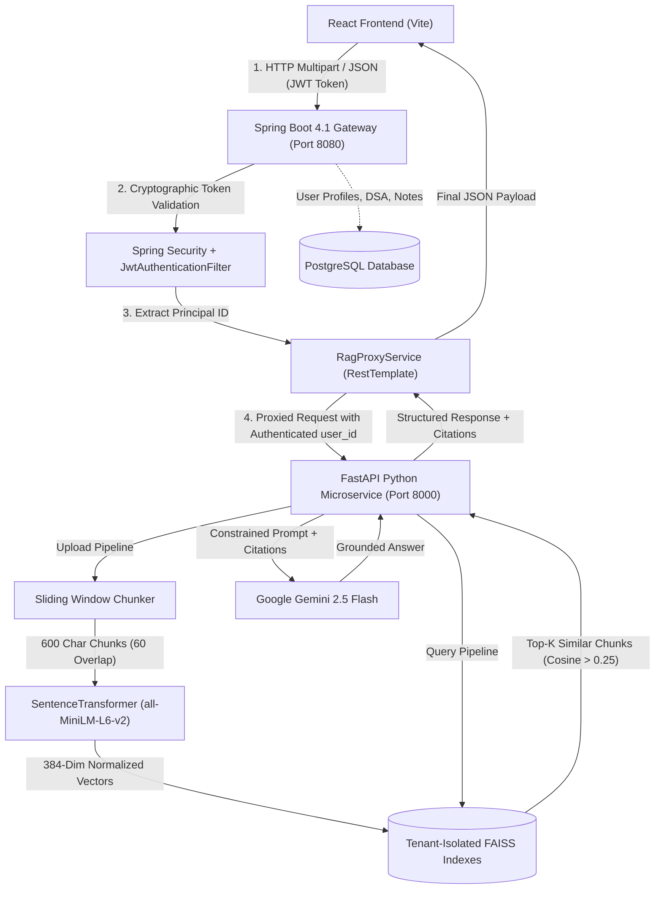

# Enterprise RAG System Architecture

CodeMentor implements a multi-tier Retrieval-Augmented Generation architecture designed for enterprise scalability, strict tenant isolation, and verifiable citations.

---

## 1. System Topology & Component Diagram

---

## 2. Ingestion Pipeline Breakdown

1. **Document Upload:**
   - Supported file formats: `.pdf` (with page tracking via `pypdf`), `.docx` (via `python-docx`), `.txt`, `.md`.
2. **Document Processing (`DocumentProcessor`):**
   - Extracts clean text while preserving original page numbers for citation accuracy.
3. **Sliding-Window Chunking (`Chunker`):**
   - Breaks text into 600-character segments with 60-character sliding overlap (10%).
   - Looks back up to 30% of the chunk window to break cleanly on sentence boundaries (`.`, `!`, `?`, `\n`).
4. **Vector Embedding (`EmbeddingService`):**
   - Dense representation generated by `sentence-transformers/all-MiniLM-L6-v2` (384 float32 dimensions).
   - Normalized in-place using `faiss.normalize_L2()`.
5. **Isolated Persistence (`VectorStore`):**
   - Stored in `python-rag/storage/users/{user_id}/index.faiss`.
   - Chunk text and metadata stored in companion `chunks.json`.
   - File records stored in `documents.json`.

---

## 3. Query & Generation Pipeline Breakdown

1. **Authentication:**
   - User queries `/api/rag/query` with HTTP `Authorization: Bearer <JWT>`.
   - Spring Boot extracts verified user ID and passes it to Python FastAPI `/rag/query`.
2. **Query Vectorization:**
   - User question is encoded into a unit-normalized 384-dim vector.
3. **FAISS Retrieval:**
   - FAISS searches strictly within `storage/users/{user_id}/index.faiss`.
   - Retrieves top-$K$ chunks ranked by inner product (exact cosine similarity).
   - Filters out any candidate chunk with score $< 0.25$ (`SIMILARITY_THRESHOLD`).
4. **Prompt Construction (`LLMService`):**
   - Constrained system prompt instructs the model to answer strictly from the context blocks.
   - Requires inline citation markers `[filename, p.X]`.
5. **Inference & Fallback:**
   - Calls Google Gemini 2.5 Flash at low temperature (0.2).
   - If retrieved context is insufficient or empty, immediately returns:
     > *"I cannot find sufficient information in your uploaded documents to answer this question."*

---

## 4. Latency Profile & Performance Benchmarks

| Stage | Execution Environment | Latency (CPU) |
| :--- | :--- | :--- |
| **JWT Validation & Gateway Routing** | Spring Boot (JVM) | ~2ms |
| **Document Text Parsing (10pg PDF)** | Python `pypdf` | ~85ms |
| **Sliding Window Chunking** | Python Regex | ~4ms |
| **Embedding Generation (Batch of 10)** | CPU PyTorch / MiniLM-L6-v2 | ~45ms |
| **FAISS Vector Search (1,000 vectors)** | C++ AVX2 SIMD | ~0.3ms |
| **Gemini LLM Generation** | Google API (Flash 2.5) | ~400-800ms |
| **Total Query Turnaround** | End-to-End | **~450-850ms** |
